### Hi, I'm Gigi

Cybersecurity Systems (Honors) student at St. John's University and a **Break Through Tech AI Program Fellow**, focused on bringing machine learning into both the offensive and defensive sides of security.

I'm currently looking for a **cybersecurity or AI security internship** where fundamentals and applied ML both matter.

- Certified in penetration testing, ethical hacking, and digital forensics (TCM Academy, HackTheBox Academy, Scientific Cyber Security Association)
- Building applied ML skills through Break Through Tech — Python, scikit-learn, model evaluation, and neural networks
- 2× 1st Place, St. John's Hacks (2025, 2026) · Qualified for NECCDC 2026 · Placed at ISC2 NYC CTF and BSides NYC CTF
- Reach me: **gigi.rurua24@my.stjohns.edu** · [LinkedIn](https://www.linkedin.com/in/giorgi-rurua/)

---

### Currently Learning
Working through **Break Through Tech's Machine Learning Foundations** coursework — the full ML lifecycle from data cleaning through supervised learning and neural networks, applied to a real predictive modeling problem (see pinned project below).

---

### Tech Stack

**Security**

**ML & Data**

**Languages & Tools**

---

### Featured Project — Break Through Tech Capstone

**[Airbnb NYC Premium Listing Classifier](https://github.com/GigiRurua/airbnb-premium-listing-classifier)**

Trained and compared a tuned Decision Tree (83.6% accuracy, F1 0.627) against a feedforward neural network (81.9% accuracy, F1 0.650) to predict which Airbnb NYC listings qualify as premium/high-price, on a dataset of 28,000+ listings. Includes a full fairness analysis of neighborhood as a proxy variable for race and income. Full write-up and results in the repo.

---

### Other Projects

**[SlideGen-AI](https://github.com/GigiRurua/SlideGen-AI-Hackathon)** — 1st Place, St. John's Hacks 2026
An end-to-end pipeline that turns spoken lectures into structured slide decks using OpenAI Whisper + Claude, delivered straight into PowerPoint via a mobile app and a 6-digit join code.

**[CampusCircle](https://github.com/GigiRurua/CampusCircle)** — 1st Place, St. John's Hacks 2025
A React Native app for student club discovery, with Google Calendar sync, secure authentication, and real-time group chat.

---

### Certifications
- Practical Ethical Hacking — TCM Academy (2024)
- Penetration Testing — HackTheBox Academy (2023)
- Ethical Hacking — Scientific Cyber Security Association (2022)
- Machine Learning Foundations — Break Through Tech *(in progress)*

---

### Leadership & Involvement
- **ACM Student Chapter, CyberStorm** — qualified for NECCDC 2026; placed at ISC2 NYC CTF and BSides NYC CTF
- **HeraXXI** — Board Member; run resume/LinkedIn workshops for 100+ students

---

### GitHub Stats

)

